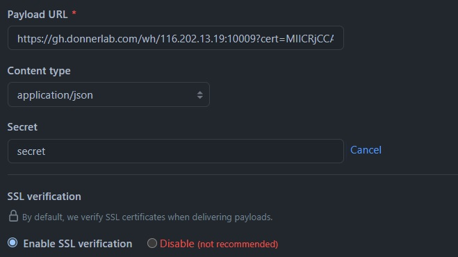
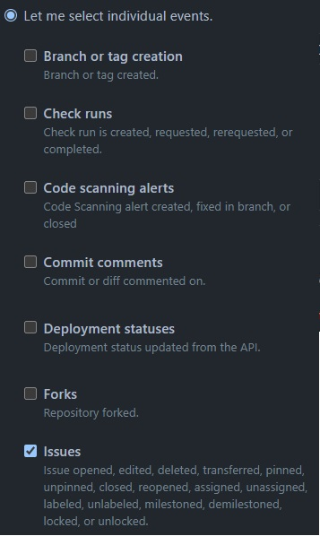
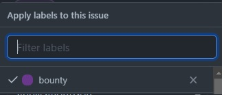

# Github-Bounty

Github bounty can be used as a way do collect donations for specific issues.

Example use-cases are shown in this repos issues.

You can run it yourself (more privacy, usable in private repos) or use my hosted service (non-custodial, only useable in public repos).

## Usage

In order to use our hosted service you need to have a lnd node running with a publicly reachable rpc server.

1. create a lnd-connect string with invoice macaroon permissions i.e. `lndconnect -j --invoice`

2. Create a webhook in your repo with `https://gh.donnerlab.com/wh/{lnd connect string without lndconnect://}` the secret is "secret"

   
3. Select individual events with only the issues tag

   
4. Your repo should now be actived. You can now add the 'bounty' label to any issue

   
5. The bot will comment and users can request invoices with the url (they can change the amount from the url)

